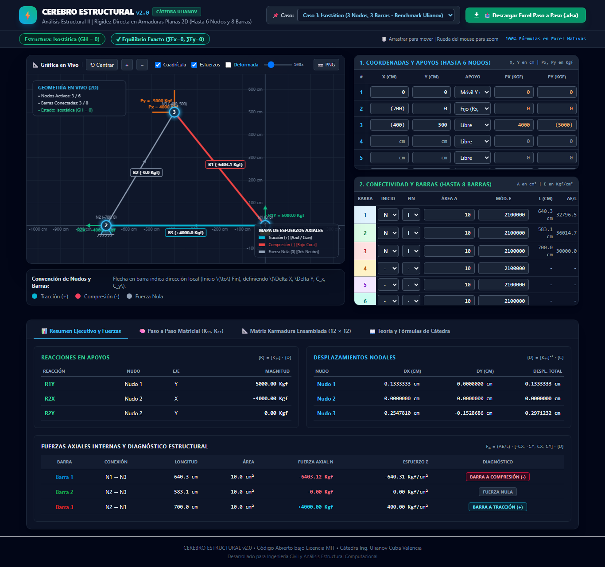

# ⚡ CEREBRO ESTRUCTURAL v2.0
### Simulador Interactivo de Armaduras Planas 2D & Generador Maestro de Hojas Excel Automatizadas
**Cátedra:** Análisis Estructural II | **Profesor:** Ing. Ulianov Cuba Valencia

[](https://pages.github.com/)
[](LICENSE)
[](truss-canvas.js)
[](excel-generator.js)
[](test_webapp.py)

---

## 🌟 Visión del Proyecto

**CEREBRO ESTRUCTURAL** es una plataforma web autónoma, moderna, interactiva y de código abierto orientada a estudiantes, ingenieros civiles e investigadores estructurales.

Permite modelar en tiempo real armaduras planas (hasta **6 nodos** y **8 barras**), visualizar instantáneamente la geometría con flechas direccionales de eje local, condiciones de frontera (apoyos fijos, móviles en X y móviles en Y) y vectores de carga actuantes. 

El núcleo central del sistema cumple la premisa maestra: **con literalmente UN SOLO CLIC genera y descarga el libro de cálculo Excel (.xlsx) estructurado paso a paso**, con **fórmulas vivas y dinámicas** (`=MINVERSE(...)`, `=MMULT(...)`, `=VLOOKUP(...)`, `=SQRT(...)`, `=IF(...)`), trazabilidad cromática por barra y las 5 tarjetas pedagógicas de cátedra.

---

## 📸 Captura de la Aplicación en Ejecución



---

## 🚀 Características Principales

### 1. 📐 Gráfica en Vivo 2D Interactiva (HTML5 Canvas)
- **Renderizado Reactivo al Instante**: Al editar cualquier coordenada $(X, Y)$, apoyo o carga, el gráfico se actualiza en microsegundos sin recargar la página.
- **Flechas Direccionales de Barra**: Cada barra cuenta con una flecha central que indica la orientación del eje local $+x'$ (Nodo Inicio $\to$ Nodo Fin), facilitando la comprensión de los cosenos directores $C_x$ y $C_y$.
- **Simbología Estructural Normalizada**:
  - **Apoyo Fijo (Articulación)**: Triángulo anclado con rayado de suelo empotrado (Rx=1, Ry=1).
  - **Apoyo Móvil en Y**: Apoyo con ruedas horizontales que restringe el eje vertical (Ry=1, Rx=0).
  - **Apoyo Móvil en X**: Apoyo con ruedas verticales que restringe el eje horizontal (Rx=1, Ry=0).
- **Vectores de Carga y Reacciones**: Flechas de color naranja para cargas aplicadas ($P_x, P_y$) y verde esmeralda para reacciones calculadas ($R_{1Y}, R_{2X}$, etc.).
- **Deformada Estructural**: Permite alternar la visualización de la estructura deformada respecto a la indeformada con control deslizante de factor de escala ($10\times$ a $500\times$).
- **Mapa de Esfuerzos Axiales**: Código de color en barras:
  - 🔵 **Cian/Azul**: Barra a Tracción (+)
  - 🔴 **Rojo Coral**: Barra a Compresión (-)
  - ⚪ **Gris Neutro**: Barra de Fuerza Nula (0)
- **Controles de Cámara**: Zoom con rueda de ratón / gestos táctiles, paneo por arrastre, botón de centrado rápido y exportación de captura en PNG de alta resolución.

### 2. 📥 Descarga de Excel Automatizado con Fórmulas Vivas (1 Clic)
- Generación 100% en el navegador del usuario mediante `ExcelJS` (funciona completamente **offline** y en **GitHub Pages** con cero dependencias de servidor).
- Genera dos pestañas completas:
  - `MANUAL_ISOSTATICA_3R`: Plantilla para armaduras isostáticas con regularización matricial.
  - `MANUAL_HIPERESTATICA_4R`: Plantilla para armaduras hiperestáticas.
- **Fórmulas Nativas en cada celda**: Si abres el archivo en Microsoft Excel o Google Sheets y modificas cualquier valor de carga o coordenada, **todo el libro se recalcula automáticamente en tiempo real**.
- **Trazabilidad Cromática**: Paleta oficial de 8 colores pastel; cada celda de las matrices locales $4 \times 4$ y expandidas $12 \times 12$ hereda el color de su respectiva barra.
- **Tarjetas Pedagógicas**: 5 tarjetas con la explicación conceptual y matemática al costado derecho del cálculo.

### 3. 🧠 Motor Matricial de Rigidez Directa en JavaScript
- Inversión matricial por Gauss-Jordan con pivoteo parcial.
- Detección automática de grados de libertad libres y restringidos.
- Extracción dinámica de submatrices $[K_{11}]$ y $[K_{21}]$.
- Comprobación estricta de equilibrio estático global ($\sum F_x = 0$ y $\sum F_y = 0$).
- Diagnóstico automático de mecanismos o singularidad estructural.

### 4. 📚 Biblioteca de Presets de la Cátedra
1. **Caso 1: Isostático (3 Nodos, 3 Barras)** - Ejercicio benchmark resuelto de la cátedra ($P_x = 4000$ Kgf, $P_y = -5000$ Kgf).
2. **Caso 2: Hiperestático Cruz de San Andrés (4 Nodos, 6 Barras)** - Estructura arriostrada de grado 2.
3. **Caso 3: Warren Simétrica (5 Nodos, 7 Barras)** - Armadura triangular de 2 tramos.
4. **Caso 4: Armadura Tipo Techo Howe (5 Nodos, 7 Barras)** - Estructura a dos aguas con montante central.
5. **Modelo en Blanco**: Para ingresar libremente cualquier diseño nuevo.

---

## 📂 Estructura del Repositorio

```text
AUTOMATIZACION/
│
├── index.html                   # Interfaz de usuario responsiva (Tailwind CSS)
├── app.js                       # Controlador y enlace reactivo del estado
├── truss-canvas.js              # Motor gráfico 2D en Canvas HTML5 interactivo
├── truss-solver.js              # Solucionador numérico de rigidez directa
├── excel-generator.js           # Generador de hojas Excel con fórmulas vivas
│
├── assets/
│   └── exceljs.min.js           # Librería ExcelJS local para funcionamiento 100% offline
│
├── server.py                    # Servidor local en Python con apertura automática
├── run.bat                      # Lanzador de un solo clic para Windows
├── test_webapp.py               # Suite de pruebas automatizadas con Playwright
│
├── generate_perfect_manual_sheets.py # Generador Python de referencia (openpyxl)
├── generate_pdf_manual.py       # Generador del manual teórico en PDF
│
├── .github/
│   └── workflows/
│       └── deploy.yml           # Despliegue automático a GitHub Pages en cada push
│
├── .gitignore                   # Exclusión de temporales y cachés
├── LICENSE                      # Licencia abierta MIT
└── README.md                    # Documentación del proyecto
```

---

## ⚡ Guía de Inicio Rápido

### Método A: Abrir Directamente en el Navegador (Sin instalación)
Simplemente haz doble clic sobre `index.html` en tu explorador de archivos. Se abrirá en Google Chrome, Microsoft Edge, Firefox o Safari y funcionará al 100%, incluso sin conexión a internet.

### Método B: Ejecutar Servidor Local (Windows)
Haz doble clic en `run.bat` o ejecuta en la terminal:
```bash
python server.py
```
El navegador se abrirá automáticamente en `http://localhost:8000/index.html`.

### Método C: Ejecutar Pruebas Automatizadas
Para verificar que el solucionador matricial, el canvas y la generación de Excel funcionan sin errores:
```bash
python test_webapp.py
```

---

## 🌐 Cómo Subir este Proyecto a GitHub y Activar GitHub Pages

Para publicar este proyecto en tu cuenta de GitHub de forma totalmente pública y con hosting web gratuito:

### Paso 1: Inicializar el repositorio Git local
Abre PowerShell o terminal en esta carpeta y ejecuta:
```bash
git init
git add .
git commit -m "feat: CEREBRO ESTRUCTURAL v2.0 - Armaduras 2D y Generador Excel Automatizado"
```

### Paso 2: Crear el repositorio en GitHub y vincular
1. Entra a [github.com/new](https://github.com/new).
2. Nómbralo (por ejemplo: `cerebro-estructural` o `analisis-armaduras-excel`).
3. Deja el repositorio en **Público** (Public).
4. No inicialices con README ni .gitignore (ya están creados).
5. Copia los comandos y ejecútalos en tu terminal:
```bash
git branch -M main
git remote add origin https://github.com/TU_USUARIO/TU_REPOSITORIO.git
git push -u origin main
```

### Paso 3: Activar GitHub Pages
1. En tu repositorio de GitHub, ve a **Settings** &rarr; **Pages**.
2. En **Build and deployment** &rarr; **Source**, selecciona **GitHub Actions** (o **Deploy from a branch** &rarr; rama `main` &rarr; carpeta `/ (root)`).
3. ¡Listo! En menos de un minuto tu página web estará disponible en vivo en:
   `https://TU_USUARIO.github.io/TU_REPOSITORIO/`

---

## 📐 Fundamento Teórico: Método de la Rigidez Directa

### 1. Transformación de Coordenadas de Elemento
Para cada barra $m$ que conecta el nodo inicial $(X_i, Y_i)$ con el nodo final $(X_j, Y_j)$:
$$\Delta X = X_j - X_i, \quad \Delta Y = Y_j - Y_i$$
$$L = \sqrt{\Delta X^2 + \Delta Y^2}$$
$$C_x = \frac{\Delta X}{L}, \quad C_y = \frac{\Delta Y}{L}$$

### 2. Matriz de Rigidez Local en Coordenadas Globales $[k_m]$ ($4 \times 4$)
$$[k_m] = \frac{AE}{L} \begin{bmatrix}
 C_x^2 &  C_x C_y & -C_x^2 & -C_x C_y \\
 C_x C_y &  C_y^2 & -C_x C_y & -C_y^2 \\
-C_x^2 & -C_x C_y &  C_x^2 &  C_x C_y \\
-C_x C_y & -C_y^2 &  C_x C_y &  C_y^2
\end{bmatrix}$$

### 3. Partición Cinemática del Sistema Global
$$\begin{Bmatrix} \{C_{libres}\} \\ \{R_{apoyos}\} \end{Bmatrix} = \begin{bmatrix} [K_{11}] & [K_{12}] \\ [K_{21}] & [K_{22}] \end{bmatrix} \begin{Bmatrix} \{D_{libres}\} \\ \{0\} \end{Bmatrix}$$

- **Desplazamientos Nodales**:
  $$\{D_{libres}\} = [K_{11}]^{-1} \cdot \{C_{libres}\}$$
  *(Calculado en Excel mediante `=MMULT(MINVERSE(K11), C)`)*

- **Reacciones en Apoyos**:
  $$\{R\} = [K_{21}] \cdot \{D_{libres}\}$$
  *(Calculado en Excel mediante `=MMULT(K21, D)`)*

- **Fuerza Axial Interna en la Barra $m$**:
  $$F_m = \frac{AE}{L} \begin{bmatrix} -C_x & -C_y & C_x & C_y \end{bmatrix} \begin{Bmatrix} D_{iX} \\ D_{iY} \\ D_{jX} \\ D_{jY} \end{Bmatrix}$$
  - Si $F_m > 0 \implies$ **Tracción (+)**
  - Si $F_m < 0 \implies$ **Compresión (-)**
  - Si $F_m = 0 \implies$ **Fuerza Nula**

---

## 📄 Licencia

Este proyecto está bajo la Licencia Abierta **MIT**. Eres libre de usarlo, modificarlo, compartirlo y adaptarlo con fines académicos, pedagógicos y profesionales.

**Desarrollado con pasión para la Cátedra de Análisis Estructural II - Ing. Ulianov Cuba Valencia.**
